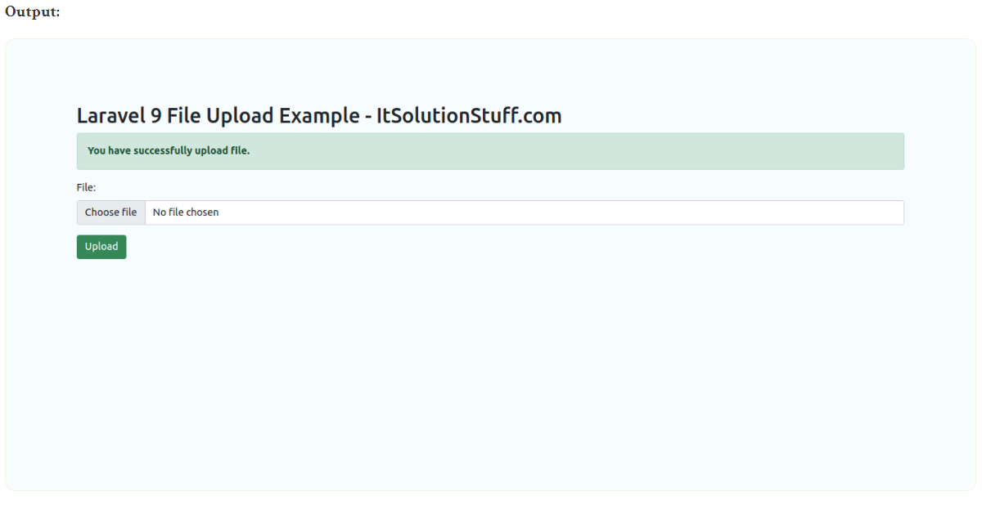

# laravel9_file_upload
## 1. Laravel 9 Form Validation
- Tạo mới một project laravel;

```Dockerfile
composer create-project laravel/laravel laravel9_file_upload
```

## 2. Create Controller

```Dockerfile
php artisan make:controller FileController
```
- Vào app/Http/Controllers/FileController.php

```Dockerfile
<?php
  
namespace App\Http\Controllers;
   
use Illuminate\Http\Request;
  
class FileController extends Controller
{
    /**
     * Display a listing of the resource.
     *
     * @return \Illuminate\Http\Response
     */
    public function index()
    {
        return view('fileUpload');
    }
    
    /**
     * Display a listing of the resource.
     *
     * @return \Illuminate\Http\Response
     */
    public function store(Request $request)
    {
        $request->validate([
            'file' => 'required|mimes:pdf,xlx,csv|max:2048',
        ]);
    
        $fileName = time().'.'.$request->file->extension();  
     
        $request->file->move(public_path('uploads'), $fileName);
   
        /*  
            Write Code Here for
            Store $fileName name in DATABASE from HERE 
        */
     
        return back()
            ->with('success','You have successfully upload file.')
            ->with('file', $fileName);
   
    }
}
```

Lưu trữ hình ảnh trong thư mục lưu trữ(Storage Folder)

```Dockerfile
$request->file->storeAs('uploads', $fileName);
// storage/app/uploads/file.png
```

Lưu trữ Hình ảnh trong Thư mục Public

```Dockerfile
$request->file->move(public_path('uploads'), $fileName);
// public/uploads/file.png
```
Lưu trữ hình ảnh trong S3

```Dockerfile
$request->file->storeAs('uploads', $fileName, 's3');
```

## 3.Create and Add Routes
routes/web.php

```Dockerfile
<?php
  
use Illuminate\Support\Facades\Route;
  
use App\Http\Controllers\FileController;
  
/*
|--------------------------------------------------------------------------
| Web Routes
|--------------------------------------------------------------------------
|
| Here is where you can register web routes for your application. These
| routes are loaded by the RouteServiceProvider within a group which
| contains the "web" middleware group. Now create something great!
|
*/
  
Route::get('file-upload', [FileController::class, 'index']);
Route::post('file-upload', [FileController::class, 'store'])->name('file.store');
```
## 4. Create Blade FileTạo
Tạo  fileUpload.blade.php trong resources/views/

```Dockerfile
<!DOCTYPE html>
<html>
<head>
    <title>Laravel 9 File Upload Example - ItSolutionStuff.com</title>
    <link href="https://cdn.jsdelivr.net/npm/bootstrap@5.0.2/dist/css/bootstrap.min.css" rel="stylesheet">
</head>
      
<body>
<div class="container">
       
    <div class="panel panel-primary">
  
      <div class="panel-heading">
        <h2>Laravel 9 File Upload Example - ItSolutionStuff.com</h2>
      </div>
  
      <div class="panel-body">
       
        @if ($message = Session::get('success'))
            <div class="alert alert-success alert-block">
                <strong>{{ $message }}</strong>
            </div>
        @endif
      
        <form action="{{ route('file.store') }}" method="POST" enctype="multipart/form-data">
            @csrf
  
            <div class="mb-3">
                <label class="form-label" for="inputFile">File:</label>
                <input 
                    type="file" 
                    name="file" 
                    id="inputFile"
                    class="form-control @error('file') is-invalid @enderror">
  
                @error('file')
                    <span class="text-danger">{{ $message }}</span>
                @enderror
            </div>
   
            <div class="mb-3">
                <button type="submit" class="btn btn-success">Upload</button>
            </div>
       
        </form>
      
      </div>
    </div>
</div>
</body>
    
</html>
```

## 5. Chạy project

```Dockerfile
php artisan serve
```
-  Vào 
http://localhost:8000/file-upload



